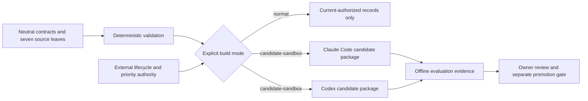

<p align="center">
  
</p>

# Rigwright

[](https://gitlab.com/krahul02004/Rigwright/-/commits/main)
[](https://pypi.org/project/rigwright/)
[](LICENSE)

> A proposal-only system for authoring and evaluating small atomic skills across Claude Code and Codex.

Rigwright combines one neutral skill contract with thin surface adapters. Each capability stays independently measurable, and lifecycle state and routing priority stay with an external lifecycle authority rather than with this repository.

**Current state:** version `0.1.0` is a pre-release candidate. Nothing in this repository installs, enables, exposes, promotes, or publishes a skill or plugin. Generated packages are offline evaluation evidence, not installations.

## Seven atomic leaves

| Leaf | Owns one outcome | Does not own |
|---|---|---|
| `rigwright-route` | Select exactly one eligible Rigwright leaf or return a bounded block. | Authoring, execution, installation, or promotion. |
| `rigwright-author-skill` | Produce one contract-valid atomic skill with adapters and evals. | Plugin containers, promotion evaluation, or activation. |
| `rigwright-author-plugin` | Produce one surface-native plugin container around existing skills. | MCPs, agents, hooks, commands, apps, or marketplaces. |
| `rigwright-evaluate` | Compare one frozen candidate with frozen baselines and retain regressions. | Rewriting or promoting the candidate. |
| `rigwright-migrate` | Produce a compatibility-preserving successor and rollback proposal. | Live cutover, file movement, or discovery changes. |
| `rigwright-prioritize` | Select at most one lifecycle-eligible canonical owner. | Installation, enablement, or candidate promotion. |
| `rigwright-archive` | Create a copy-only packet with hashes and restore proof. | Deletion, live archive state, or removal from discovery. |

Future MCP, agent, hook, command, and app authoring remains separately gated and absent from the source tree; the validator fails if such a leaf appears before its gate opens.

## Authority flow



Folder presence is not activation. A normal build excludes candidate, alias, archived, quarantined, rejected, and unavailable records. An external lifecycle authority remains the lifecycle and priority owner.

## Install

The CLI is published on PyPI as [`rigwright`](https://pypi.org/project/rigwright/) and requires Python 3.12 or newer:

```sh
pip install rigwright
```

Run it from a disposable clone or worktree of this repository:

```sh
rigwright gate            # complete offline gate
rigwright validate-contract
rigwright build-adapters --mode candidate-sandbox
```

The same gate also runs without installing anything: `python tools/run_all.py`. The complete gate writes reproducible build and validation evidence under `artifacts/` (untracked). It does not install a generated package.

For the exact current counts and the cache-free assessment pattern, see [Validation](docs/public/validation.md).

## Safety and limitations

- `0.1.0` is a pre-release, published to PyPI as `rigwright`. No git tag, host Release, skill installation, or promotion exists.
- Original Rigwright material is MIT licensed under Rahul Krishna. Captured and imported material retains its original terms and is not relicensed; raw captures are retained privately and are not part of this repository.
- An internal blinded runtime evaluation of candidate and baseline conditions was run on both surfaces. It does not authorize promotion, and producing Codex plugin manifests that pass the native validator for a dual-surface plugin remains an open problem. See [Conflicts and open problems](docs/conflicts-and-blockers.md).
- The offline gates prove deterministic contract and fixture coverage only. They are not adoption, production, or model-superiority claims.
- Generated packages under `artifacts/` are evaluation evidence, not installations or marketplace distributions.
- No dedicated public security-reporting contact has been designated yet; report privately through the GitLab project rather than a public issue. See [Security policy](SECURITY.md).

## Project documents

- [Architecture](docs/public/architecture.md)
- [Configuration](docs/public/configuration.md)
- [Validation](docs/public/validation.md)
- [Privacy and retained evidence](docs/public/privacy-and-evidence.md)
- [Release readiness](docs/public/release-readiness.md)
- [Contributing](CONTRIBUTING.md)
- [Roadmap](ROADMAP.md)
- [Changelog](CHANGELOG.md)

Rigwright is authored by Rahul Krishna and distributed under the [MIT License](LICENSE). See [third-party notices](THIRD_PARTY_NOTICES.md) for retained-source boundaries.
