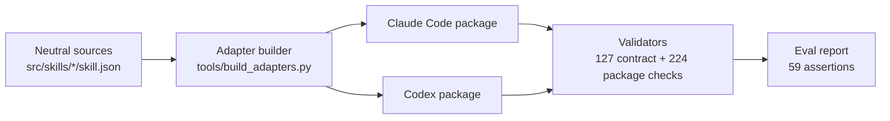

<p align="center">
  
</p>

# Rigwright

[](https://gitlab.com/krahul02004/Rigwright/-/commits/main)
[](https://pypi.org/project/rigwright/)
[](LICENSE)

Rigwright authors and evaluates small, single-purpose skills for AI coding agents: the reusable instruction files that Claude Code and Codex load to handle one kind of task well. In practice, skill files sprawl into catch-all documents where no one can tell whether an edit helped, and each platform needs the same skill re-packaged by hand in its own format. Rigwright gives every skill one measurable outcome and its own eval set (test prompts with expected behavior), then generates the packaging for each platform from a single neutral source, validated against both platforms' native schemas.

## Getting started

- **Prerequisites:** Python 3.12 or newer.
- **Install:** `pip install rigwright`. The CLI is published on PyPI as [`rigwright`](https://pypi.org/project/rigwright/). See [Install](#install) for the run-from-clone alternative that needs no install at all.
- **Check it works:** from a clone of this repository, run `rigwright gate`. It runs the full offline gate (contract, build, package, determinism, fixtures, and evals) and prints `offline gate PASS: 8/8 commands`.

## One skill, end to end

Every skill is one neutral JSON record. Here is `rigwright-author-skill`, the skill that authors other skills (trimmed):

```jsonc
// src/skills/rigwright-author-skill/skill.json
{
  "id": "rigwright-author-skill",
  "intent": "Create or improve one atomic neutral skill source.",
  "outcome": "Produce one contract-valid skill, its eval set, and requested thin surface adapters.",
  "non_goals": ["Create a plugin container", "Run promotion evaluation", "Install or activate a skill", /* … */],
  "instructions": [
    "Confirm the reusable intent, realistic positive triggers, near misses, bounded inputs, and one independently measurable outcome.",
    "Record a no-skill or prior-version baseline before final prose and define at least three positive eval cases plus one realistic near miss.",
    // …
  ],
  "eval_path": "evals/evals.json"
}
```

One command builds all seven records into platform-native packages:

```console
$ python -B tools/build_adapters.py --mode candidate-sandbox --output-root artifacts/build
adapter build candidate-sandbox: 7 included, 0 excluded
```

For Claude Code, that generates a plugin manifest plus one `SKILL.md` per skill (trimmed):

```markdown
<!-- artifacts/build/claude-code/rigwright/skills/rigwright-author-skill/SKILL.md -->
---
name: rigwright-author-skill
description: "Authors or improves one atomic neutral skill and emits requested Claude Code or Codex adapters. Use when a user asks to create, refactor, tighten, or add evals to a skill without installing or activating it."
---

# Rigwright Author Skill

Create or improve one atomic neutral skill source.

## Procedure

1. Confirm the reusable intent, realistic positive triggers, near misses, bounded inputs, and one independently measurable outcome.
2. Record a no-skill or prior-version baseline before final prose and define at least three positive eval cases plus one realistic near miss.
   …

This is a generated `claude-code` adapter. Edit the neutral `src/skills/rigwright-author-skill/skill.json` source instead of this file.
```

The Codex package carries the same skill body under Codex's own manifest layout, plus the UI metadata Codex keeps in a separate file:

```yaml
# artifacts/build/codex/rigwright/skills/rigwright-author-skill/agents/openai.yaml
interface:
  display_name: "Rigwright Author Skill"
  short_description: "Use Rigwright Author Skill workflow"
  default_prompt: "Use $rigwright-author-skill for this bounded proposal task."
policy:
  allow_implicit_invocation: false
```

Each skill ships its own eval set (prompts that must trigger it and realistic near misses that must not), and one command rebuilds both adapter modes and replays them all:

```console
$ python -B tools/run_evals.py
offline evals passed: 59 assertions, 7 near misses, 6 fixed tasks
```

All output above is from a real run on this tree.

## The seven skills

| Skill | What it does |
|---|---|
| `rigwright-route` | Picks which single Rigwright skill should handle a request. |
| `rigwright-author-skill` | Writes or improves one skill, with its eval set and platform adapters. |
| `rigwright-author-plugin` | Wraps existing skills into one platform-native plugin container. |
| `rigwright-evaluate` | Compares a frozen candidate skill against frozen baselines and records regressions. |
| `rigwright-migrate` | Plans a backward-compatible successor for a skill, with a rollback path. |
| `rigwright-prioritize` | Picks which one skill owns an intent when several overlap. |
| `rigwright-archive` | Packages a retiring skill as a hash-verified copy with restore proof. |

Each skill is deliberately narrow: anything beyond its one outcome (installing, activating, promoting) is out of scope by contract, and the validator enforces those boundaries. The per-skill boundary lists are in [STATUS.md](STATUS.md).

## How it works



The neutral record is the single source of truth; generated files say so and point back to it. Builds are deterministic: rebuilding produces byte-identical trees and archives, and `tools/verify_determinism.py` proves it. Beyond Rigwright's own validators, a manual CI job runs each platform's native validator (`claude plugin validate` and the Codex plugin validator) against the generated packages.

## Install

The CLI is on PyPI as [`rigwright`](https://pypi.org/project/rigwright/) and needs Python 3.12+:

```sh
pip install rigwright
```

Run the complete offline gate from a clone of this repository with `rigwright gate`, or with no install at all:

```console
$ python tools/run_all.py
offline gate PASS: 8/8 commands
```

The eight commands and their current one-line results:

```text
source fingerprint skipped: no config/sources.json
contract validation passed: 127 checks, 7 leaves, 32 eval cases
adapter build normal: 0 included, 7 excluded
adapter build candidate-sandbox: 7 included, 0 excluded
package validation passed: 224 checks
determinism passed: 2 surface packages
runtime fixtures passed: 6 tasks, 4 conditions, 3 replicates
offline evals passed: 59 assertions, 7 near misses, 6 fixed tasks
```

Evidence is written under `artifacts/` (untracked). See [Validation](docs/public/validation.md) for the cache-free assessment pattern.

**Status:** `0.1.0` is a pre-release candidate on PyPI: the seven skills are proposals under review, and nothing in this repository installs or activates anything; full current state in [STATUS.md](STATUS.md).

## Safety and limitations

- Generated packages under `artifacts/` are offline evaluation evidence, not installations. Which skill version is live is decided outside this repository, by the owner's separate lifecycle registry (see [STATUS.md](STATUS.md)).
- **Open problem:** producing Codex plugin manifests that pass Codex's native validator for a dual-surface plugin. Rigwright's own generated Codex package passes the captured validators, but that is candidate-local evidence and does not settle the general case. See [Conflicts and open problems](docs/conflicts-and-blockers.md).
- The offline gates prove deterministic contract and fixture coverage; they are not adoption, production, or model-quality claims. An internal blinded runtime evaluation was run on both platforms; it does not authorize promotion.
- Original material is MIT licensed under Rahul Krishna. Captured third-party material retains its original terms and is not relicensed; see [third-party notices](THIRD_PARTY_NOTICES.md).
- No dedicated public security contact exists yet; report privately through the GitLab project rather than a public issue. See [Security policy](SECURITY.md).

## Project documents

- [Status](STATUS.md)
- [Architecture](docs/public/architecture.md)
- [Configuration](docs/public/configuration.md)
- [Validation](docs/public/validation.md)
- [Privacy and retained evidence](docs/public/privacy-and-evidence.md)
- [Release readiness](docs/public/release-readiness.md)
- [Contributing](CONTRIBUTING.md)
- [Roadmap](ROADMAP.md)
- [Changelog](CHANGELOG.md)

Rigwright is authored by Rahul Krishna and distributed under the [MIT License](LICENSE).
