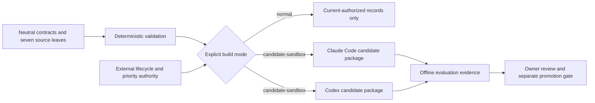

# Status

**Current state:** source version `0.2.0` is a pre-release candidate. PyPI still carries
[`rigwright` 0.1.0](https://pypi.org/project/rigwright/) for the offline CLI only; no `v0.2.0` git
tag, GitLab Release, or 0.2.0 publication exists. Nothing in this repository installs, enables,
exposes, promotes, or publishes a skill or plugin.

## Proposal-only, in practice

- Generated packages under `artifacts/` are offline evaluation evidence, not installations or marketplace distributions.
- Folder presence is not activation. A generated package existing on disk gives it no discovery, routing, or execution rights anywhere.
- The complete offline gate (`python tools/run_all.py`) builds, validates, and evaluates candidates; it performs no provider, marketplace, release, publication, or live-skill step.

## Lifecycle authority

Rigwright separates capability content from lifecycle state. Which record is live and which record wins a routing collision is decided by an external lifecycle authority: the owner's separate capability registry, outside this repository. This repository only proposes records and evidence into that decision.

Records carry one of the lifecycle states defined in the [proposed lifecycle and priority schema](docs/lifecycle-priority.md): `current-authorized`, `candidate-sandbox`, `compatibility-alias`, `archived-retained`, `quarantined-untrusted`, and `rejected`. A normal build includes only `current-authorized` records; candidate, alias, archived, quarantined, rejected, and unavailable records are excluded and cannot displace a current owner. All seven skills are currently `candidate-sandbox`, which is why `--mode normal` builds zero packages today:

```text
adapter build normal: 0 included, 7 excluded
adapter build candidate-sandbox: 7 included, 0 excluded
```

### Authority flow



## What each skill does not own

Every skill's contract lists explicit non-goals, and the validator enforces them:

| Skill | Does not own |
|---|---|
| `rigwright-route` | Authoring, execution, installation, or promotion. |
| `rigwright-author-skill` | Plugin containers, promotion evaluation, or activation. |
| `rigwright-author-plugin` | MCPs, agents, hooks, commands, apps, or marketplaces. |
| `rigwright-evaluate` | Rewriting or promoting the candidate. |
| `rigwright-migrate` | Live cutover, file movement, or discovery changes. |
| `rigwright-prioritize` | Installation, enablement, or candidate promotion. |
| `rigwright-archive` | Deletion, live archive state, or removal from discovery. |

Future MCP, agent, hook, command, and app authoring remains separately gated and absent from the source tree; the validator fails if such a leaf appears before its gate opens.

## Runtime evaluation

An internal blinded runtime evaluation of candidate and baseline conditions was run on both surfaces with per-row dispositions and no computed global winner. It does not authorize promotion, and both evaluated candidate conditions retained critical-failure instances. Raw records are retained privately and are not part of this repository. Binding findings, including the open Codex-manifest problem, are in [Conflicts and open problems](docs/conflicts-and-blockers.md).

## Before any public launch

The remaining owner-gated steps are tracked in the [Roadmap](ROADMAP.md) and [Release readiness](docs/public/release-readiness.md).
