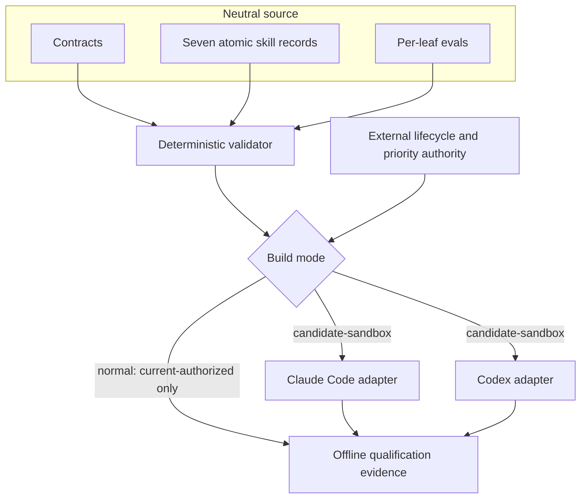

# Architecture

Rigwright separates capability content, delivery surfaces, and lifecycle authority.

## Neutral source

Each leaf declares one intent, one measurable outcome, explicit non-goals, inputs, outputs, permissions, triggers, lifecycle metadata, instructions, eval location, and provenance. The neutral record contains neither Claude-only dynamic shell injection nor Codex-only UI metadata.

## Thin surface adapters

Claude Code receives a native plugin manifest and compatible skill frontmatter. Codex receives its native plugin manifest, `name` and `description` skill frontmatter, and separate `agents/openai.yaml` UI metadata. Surface manifests are not translated by renaming keys.

## Lifecycle authority

Folder presence never activates a leaf. Normal builds admit only `current-authorized` records. Candidate, alias, archived, quarantined, rejected, and unavailable records cannot displace a current owner. A candidate enters only an explicitly named evaluation sandbox and remains below a matching current owner.

## Deliberate exclusions

The initial family does not generate MCP servers, agents, hooks, commands, apps, authentication, or marketplace entries. Those capabilities have distinct security and evaluation boundaries and require separate atomic leaves.
